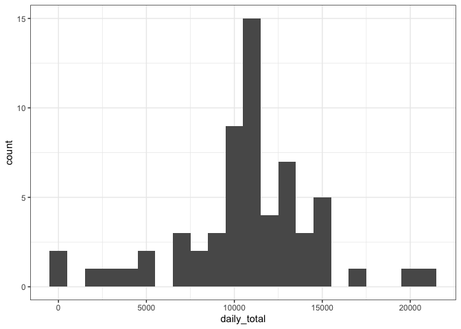

```r
library(dplyr)
library(ggplot2)
options(scipen = 999)  # this removes any scientific notation formatting of numbers
```

## Loading and preprocessing the data


```r
activity_data <- read.csv(unzip("activity.zip")) %>%
  mutate(date = as.Date(date))
```

## What is mean total number of steps taken per day?

1. First, I calculated the total number of steps taken per day by using `group_by()` and `summarize()` from the the **dplyr** package.


```r
daily_activity <-
  activity_data %>%
  group_by(date) %>%
  summarize(daily_total = sum(steps, na.rm = TRUE))
```

2. Second, it is helpful to see how often different ranges of various step totals occurred, so I used the **ggplot2** package to create a histogram of the total number of steps taken each day. I divided the bins into widths of 1,000 steps, because this would be a natural way for a user to think about their daily step totals.


```r
ggplot(data = daily_activity,
       mapping = aes(x = daily_total)
       ) +
  geom_histogram(binwidth = 1000) +
  theme_bw()
```

<!-- -->

3. Third, I calculated a daily mean and median number of steps taken per day.


```r
daily_mean <-
  daily_activity$daily_total %>%
  mean(na.rm = TRUE) %>%
  round(2)

daily_median <-
  daily_activity$daily_total %>%
  median(na.rm = TRUE)
```

The mean total number of steps taken per day was **9354.23** and the median total number of steps taken per day was **10395**.

## What is the average daily activity pattern?

1. I made a time series plot of the 5-minute intervals (x-axis) and the mean number of steps taken, averaged across all days (y-axis).


```r
daily_pattern <-
  activity_data %>%
  group_by(interval) %>%
  summarize(interval_mean = mean(steps, na.rm = TRUE))

high_interval <-
  daily_pattern %>%
  filter(interval_mean == max(interval_mean)) %>%
  pull(interval)

ggplot(data = daily_pattern,
       mapping = aes(x = interval, y = interval_mean)
       ) +
  geom_line() +
  theme_bw()
```

<!-- -->

2. I found that the **835 interval** is the 5-minute interval, on average across all the days in the dataset, that contains the maximum number of steps.

## Imputing missing values

There are a number of intervals and days with missing values (coded as `NA`). The presence of missing data for these intervals and days may introduce bias into some calculations or summaries of the data.

1. So, first I calculated the total number of missing values in the dataset (i.e. the total number of rows with `NA`s).


```r
number_of_missing <-
  activity_data %>%
  filter(is.na(steps)) %>%
  nrow()

p_missing <- round(100 * number_of_missing / nrow(activity_data), 2)
```

I found **2304** rows (13.11% of the dataset) contained `NA` (i.e., missing) values.

2. Second, I devised a strategy for filling in all of the missing values in the dataset. I took a fairly straightforward approach, substituting the mean (rounded to the nearest whole number) for the corresponding 5-minute interval for any `NA` values.

3. Third, I implemented this strategy to create a new dataset, `activity_data_full`, that is equivalent to the original dataset, but with the missing data filled in.


```r
activity_data_full <-
  activity_data %>%
  left_join(daily_pattern, by = 'interval') %>%
  mutate(steps = ifelse(is.na(steps), 
                        round(interval_mean, 0),
                        steps)
         ) %>%
  select(-interval_mean)
```

4. Fourth, I made an updated histogram of the total number of steps taken each day, with bin widths of 1,000 steps as before.


```r
daily_activity_full <-
  activity_data_full %>%
  group_by(date) %>%
  summarize(daily_total = sum(steps, na.rm = TRUE))

daily_mean_full <-
  daily_activity_full$daily_total %>%
  mean(na.rm = TRUE) %>%
  round(2)

daily_median_full <-
  daily_activity_full$daily_total %>%
  median(na.rm = TRUE)

ggplot(data = daily_activity_full,
       mapping = aes(x = daily_total)
       ) +
  geom_histogram(binwidth = 1000) +
  theme_bw()
```

<!-- -->

Earlier, I reported the mean total number of steps taken per day is **9354.23** and the median total number of steps taken per day is **10395**. 

However, when I recalculated these statistics with the imputed missing values, I found the mean total number of steps taken per day to be **10765.64** and the median total number of steps taken per day to be **10762**. 

This means that the mean values differ by **1411.41** and the median values differ by **367**. 

Thus, the impact of imputing missing data on the estimates of the total daily number of steps is to produce a histogram of total daily steps that is more nearly a normal distribution, and to correct the under-estimated mean and median number of steps taken per day caused by missing values.

## Are there differences in activity patterns between weekdays and weekends?

1. First, I created a new factor variable, `day_type`, in the dataset with two levels, "weekday" and "weekend".


```r
activity_data_full <-
  activity_data_full %>%
  mutate(day_of_week = weekdays(date),
         day_type = as.factor(ifelse(day_of_week %in% c("Saturday", "Sunday"),
                                     "weekend",
                                     "weekday")
                              )
         )
```

2. To compare differences in activity patterns between weekdays and weekends, I made a panel plot containing a time series plot of the 5-minute interval (x-axis) and the mean number of steps taken, averaged across all weekday days or weekend days (y-axis).


```r
daily_pattern_full <-
  activity_data_full %>%
  group_by(day_type, interval) %>%
  summarize(interval_mean = mean(steps, na.rm = TRUE))

ggplot(data = daily_pattern_full,
       mapping = aes(x = interval, y = interval_mean)
       ) +
  geom_line() +
  facet_grid(day_type ~ .) +
  theme_bw()
```

<!-- -->
